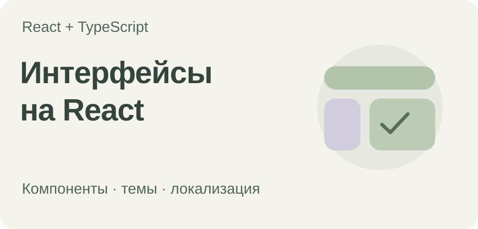

# Архитектура React-приложения

[](https://github.com/Zireael-web/advanced-frontend-project/actions/workflows/tests.yml)

Проект на **React 17 и TypeScript**, в котором я отрабатывал новые для себя технологии. Архитектуру и решения по структуре приложения, сборке, маршрутизации и общим компонентам продумал самостоятельно с нуля, опираясь на подход **Feature-Sliced Design**.

[Быстрый старт](#быстрый-старт) · [Что внутри](#что-внутри) · [Структура](#структура-проекта) · [Разработка](#разработка)

## Что внутри

- **Структура приложения:** отдельные слои `app`, `pages`, `widgets` и `shared`.
- **Навигация:** React Router 6, отложенная загрузка страниц и маршрут для неизвестных адресов.
- **Темы:** светлое и тёмное оформление с общим провайдером темы.
- **Локализация:** русский и английский языки через i18next.
- **UI-компоненты:** ссылки, кнопки, сворачиваемая боковая панель и состояния загрузки.
- **Инструменты:** настраиваемая сборка Webpack, SCSS modules и тесты утилиты для CSS-классов на Jest.

Это основа приложения и площадка для практики, а не готовый продукт. Полноценного backend и опубликованного веб-приложения в проекте нет.

## Быстрый старт

Установите Node.js и npm, затем выполните в корне репозитория:

```sh
npm ci
npm start
```

Откройте **http://localhost:3000**. Файлы переводов загружаются из `public/locales`.

В конфигурации Webpack также включён Bundle Analyzer на стандартном порту. Если после компиляции процесс сборки не завершается, проверьте, не удерживает ли его запущенный анализатор.

## Структура проекта

```text
src/
├── app/        Каркас приложения, провайдеры, маршрутизация и глобальные стили
├── pages/      Компоненты страниц
├── widgets/    Навигация, боковая панель и отображение ошибок
└── shared/     Базовые UI-компоненты, конфигурация, утилиты и ресурсы
config/
├── build/      Вспомогательные функции конфигурации Webpack
└── jest/       Конфигурация тестов
public/
└── locales/    Переводы на русский и английский
```

## Разработка

| Команда | Назначение |
| --- | --- |
| `npm start` | Запустить локальный сервер разработки |
| `npm run build:dev` | Собрать приложение в режиме разработки |
| `npm run build:prod` | Собрать приложение в режиме production |
| `npm run unit -- --runInBand` | Запустить тесты Jest |
| `npm run lint:ts` | Проверить файлы TypeScript и TSX |
| `npm run lint:scss` | Проверить SCSS |

Зависимости соответствуют существующей кодовой базе на React 17. Перед обновлением инструментов стоит проверить их совместимость.

Обложка — иллюстрация структуры проекта, а не скриншот опубликованного приложения.
